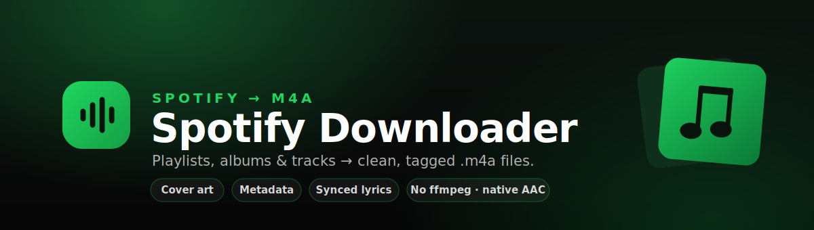
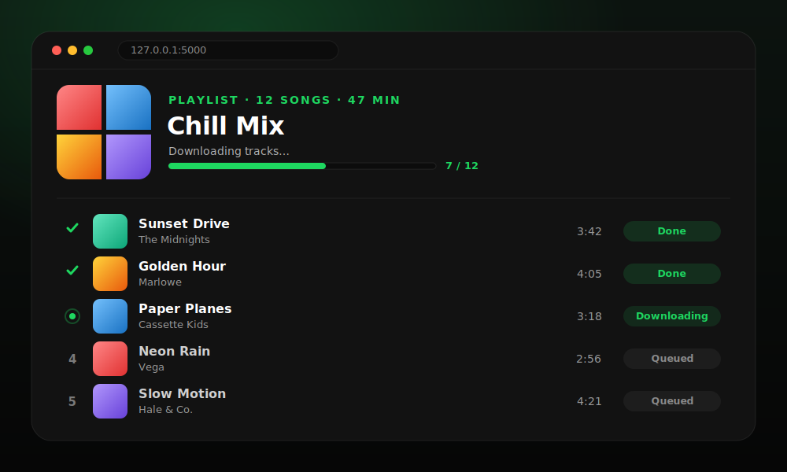
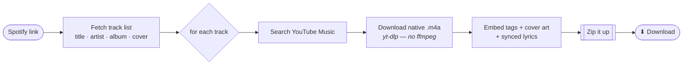

<p align="center">
  
</p>

<p align="center">
  
  
  
  
  
  
</p>

<p align="center">
  Paste a Spotify <b>playlist</b>, <b>album</b>, or <b>track</b> link — get back a zip of
  <b>tagged&nbsp;.m4a</b> files with cover art, metadata, and synced lyrics.<br>
  One reusable core engine, two front-ends: a <b>web app</b> and a <b>desktop app</b>.
</p>

> [!WARNING]
> **Personal / educational use only.** Routing Spotify → YouTube audio is against both
> services' Terms of Service. This is a learning project — don't deploy or host it publicly.

---

## ✨ Features

| Feature | What you get |
| --- | --- |
| 🎧 **Playlists, albums & tracks** | Paste any Spotify link. Playlists over 100 songs work via full pagination. |
| 🖼️ **Cover-art track list** | Every song is previewed with its **album art** before you download a thing. |
| 🏷️ **Full tagging** | Title, artist, album, album-artist, year, embedded cover art, and lyrics — all via [`mutagen`](https://mutagen.readthedocs.io/) (pure Python). |
| 🎼 **Synced lyrics** | Fetched from [LRCLIB](https://lrclib.net) (free, no key) and written as a `.lrc` sidecar. |
| ⏱️ **Live per-track status** | Watch each row go **Queued → Downloading → Done / Failed** in real time. |
| ⬇️ **Grab one or grab all** | Download the whole zip, or pull a **single track** straight from its row. |
| 🔁 **Retry failed** | A track didn't match? Retry just the failures — the zip rebuilds itself. |
| 🚫 **No ffmpeg** | Keeps YouTube's **native `.m4a` (AAC)** — no 140&nbsp;MB binary, no re-encode, better quality. |

<p align="center">
  
</p>

---

## ⚙️ How it works

Spotify doesn't hand out audio, so the engine bridges two services: it reads the
**tracklist and metadata from Spotify**, finds the matching audio on **YouTube Music**,
downloads it, and tags it — reporting progress through a single `on_progress` callback that
both front-ends render.



---

## 🚀 Quick start

**1. Install dependencies** (Python 3.11+):

```bash
pip install -r requirements.txt
```

**2. Add your Spotify API keys.** Create an app on the
[Spotify Developer Dashboard](https://developer.spotify.com/dashboard) to get a
**Client ID** and **Client Secret**, then:

```bash
cp .env.example .env      # Windows: copy .env.example .env
```

```ini
# .env
SPOTIFY_CLIENT_ID=your_client_id_here
SPOTIFY_CLIENT_SECRET=your_client_secret_here
```

**3. (For playlists) add the redirect URI.** In your Spotify app →
**Settings → Redirect URIs**, add exactly:

```text
http://127.0.0.1:5000/callback
```

> Spotify only returns **playlist** tracks to a logged-in user, so the web app has a
> "Log in with Spotify" button. **Single tracks and albums** work without logging in.

---

## 🎧 Usage

### Web app

```bash
python -m web.app
```

Open [127.0.0.1:5000](http://127.0.0.1:5000), paste a link, and hit **Load tracks**. Review the songs
(with cover art), then **Download all** — or grab individual tracks. When it's done, save
the zip, retry any failures, or hit **Convert another** to start over.

### Desktop app

```bash
python -m desktop.app
```

A simple Tkinter window — paste a link, enter your keys (or let it read `.env`), and choose
where to save the zip.

---

## 🗂️ Project structure

```text
Spotify Downloader/
├── core/                 # UI-agnostic engine (no Flask/Tkinter here)
│   ├── config.py         # loads keys from .env
│   ├── spotify_client.py # playlist / album / track + pagination
│   ├── youtube.py        # YouTube Music search → URL
│   ├── downloader.py     # yt-dlp native .m4a (no ffmpeg)
│   ├── metadata.py       # tags + cover art (mutagen)
│   ├── lyrics.py         # synced .lrc via LRCLIB (no API key)
│   ├── sanitize.py       # safe filenames
│   ├── paths.py          # temp workspace + cleanup
│   ├── packaging.py      # zip builder
│   └── pipeline.py       # orchestrator — emits progress events
├── web/                  # Flask UI (live progress over SSE)
│   ├── app.py
│   ├── templates/index.html
│   └── static/           # style.css · script.js · favicon.svg
├── desktop/app.py        # Tkinter UI (progress via a queue)
└── assets/               # banner, logos, preview graphic
```

The engine reports progress through `on_progress(message, current, total, meta)`, so both
front-ends render the exact same run — no duplicated logic.

---

## 🧠 Design notes

- **Why `.m4a` and not MP3?** YouTube already serves AAC audio. Keeping it as native
  `.m4a` means **no ffmpeg dependency**, **no CPU-heavy transcoding**, and **no lossy
  re-encode**. It plays on every phone, computer, browser, and modern car stereo. The only
  trade-off: very old / cheap dedicated MP3 players may not read `.m4a`.
- **Tagging never needs ffmpeg** — `mutagen` writes metadata, cover art, and lyrics in pure Python.
- **Long playlists** (100+ tracks) are fully supported via Spotify pagination.
- **Parallel downloads** — a few tracks run at once; tune `max_workers` in `pipeline.run()`.
- **Nothing is hosted** — temp files live in a per-run workspace and are cleaned up after.

---

## 📜 License & disclaimer

No open-source license is granted. This project exists for **personal learning** and is
**not** intended for redistribution or public deployment. You are responsible for complying
with the Spotify and YouTube Terms of Service in your jurisdiction.
